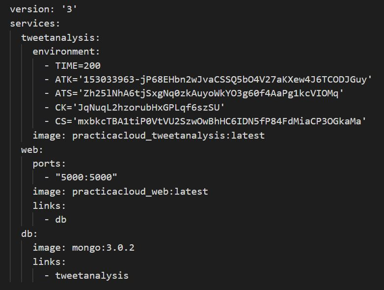

# Dockerización de una aplicación de análisis de tweets

En esta práctica se empaqueta y distribuye una aplicación Python que descarga y analiza tweets. Los resultados del análisis se guardan en una base de datos MongoDB, y la información se muestra en la web. La versión de la aplicación empaquetada en contenedores Docker realiza el análisis en local usando Hadoop streaming, mediante _mrjob_ `-r local`.

### Sobre la creación y ejecución de contenedores

#### Si se desea crear las imágenes antes de ejecutar las aplicaciones, situarse en la carpeta que contiene la práctica y ejecutar:

`$ sudo docker-compose build`

Posteriormente, para ejecutar los contenedores:

`$ sudo docker-compose up`

#### Si se desea crear las imágenes al momento de ejecutar los contenedores de las aplicaciones:

`$ sudo docker-compose up --build`

#### Si se desea descargar las imágenes de Docker-Hub en lugar de construirlas a partir de los archivos 'Dockerfile' contenidos en la práctica (como las opciones anteriores), modificar el archivo 'docker-compose.yml' de la siguiente manera:

Una vez modificado, únicamente es necesario el archivo 'docker-compose.yml'. Ejecutar entonces:

`$ sudo docker-compose up`

### Sobre la publicación de contenedores

#### Será necesario acceder a una cuenta de DockerHub:

`$ sudo docker login`

#### Para etiquetar las imágenes:

`$ sudo docker tag <image_id> <account_name> practicacloud_tweetanalysis:latest`

`$ sudo docker tag <image_id> <account_name> practicacloud_web:latest`

#### Para publicar las imágenes:

`$ sudo docker push <account_name> practicacloud_tweetanalysis:latest`

`$ sudo docker push <account_name> practicacloud_web:latest`

